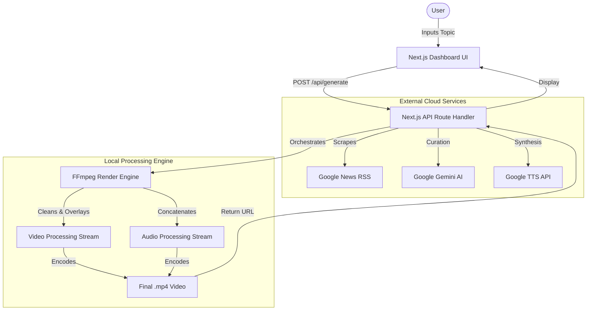
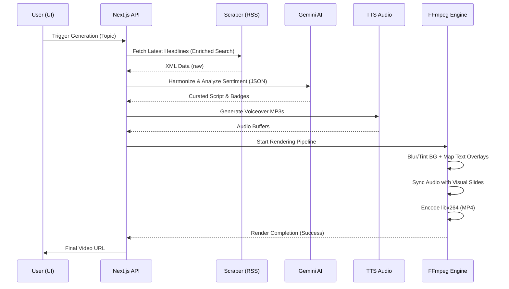
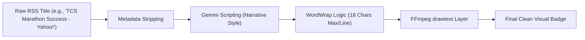

# AI Market Video Engine - Technical Documentation

## Core Technology Stack

| Component | Technology | Role |
| :--- | :--- | :--- |
| **Frontend** | Next.js 15 (React 19) | Web Dashboard, API Routes, Asset Serving |
| **Logic** | Node.js (Runtime) | Server-side execution of data & video pipelines |
| **AI (Optional)** | Google Gemini 2.5-Flash | News curation, summary generation, sentiment analysis |
| **Voiceover** | Google TTS API | AI speech synthesis (realistic financial narration) |
| **Video Engine** | FFmpeg (via fluent-ffmpeg) | Programmatic rendering, text overlays, audio merging |
| **Data Source** | Google News RSS | Real-time financial news scraping |
| **Styling** | Vanilla CSS / Tailored HSL | Glassmorphism dashboard aesthetics |

---

## 🏗️ High-Level Architecture Diagram
This diagram shows the relationship between the user interface, the Next.js API layer, and internal/external services.

---

## 🔄 Video Generation Pipeline
The step-by-step sequence of how the engine processes data to create a synchronized video.

---

## 🛠️ Internal Data Transformation Logic
A look at how we convert "raw" news headlines into "clean" mobile-friendly visuals.

---

## Optimization Details

*   **Font Management**: Manually resolves `C:\\Windows/Fonts/arial.ttf` to ensure stability across Windows deployments.
*   **Storage**: Automatically cleans up temporary `.mp3` files after the `.mp4` is rendered to the `public/` directory.
*   **Concurrency**: Uses `await new Promise` to strictly synchronize the asynchronous FFmpeg process with the Next.js response cycle.
*   **Search Enrichment**: Prepends financial keywords to short queries to avoid unrelated news topics (e.g., marathons vs. stocks).
